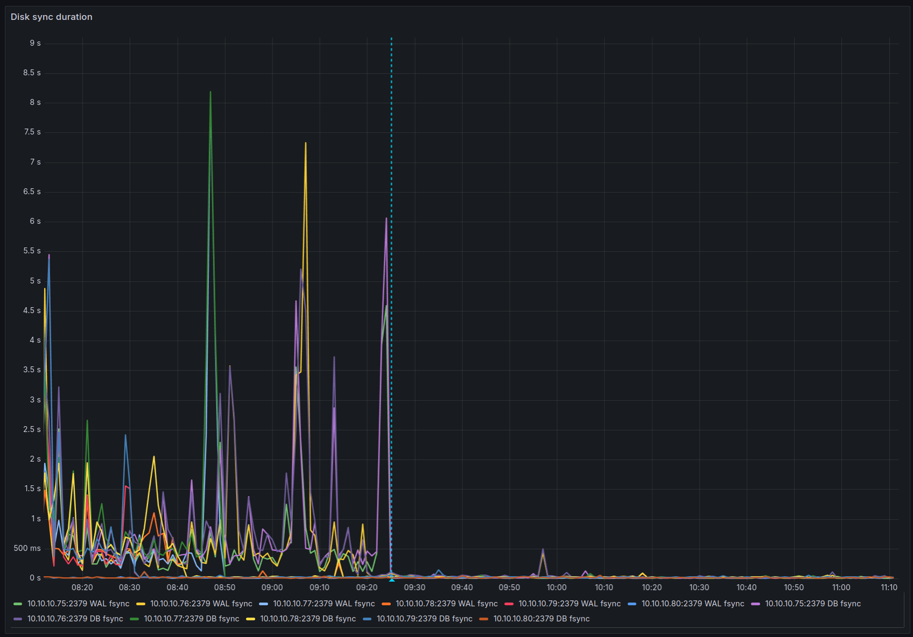

# Troubleshooting log

This is a log of various problems I have run into, their symptoms, how I diagnosed them, and how I fixed them.

## 2024-11-17 ETCD leader election lost pod restarts

I've been running into issues with etcd averaging at least 1000 leader elections per day.
This causes a lot of pod restarts, and instability in the cluster.

### Symptoms

- Prometheus Query for etcd leader elections per day: `changes(etcd_server_leader_changes_seen_total{job=~".*etcd.*", job="kube-etcd"}[1d])`
  - Main node (node with vip assigned to it): ~1000 leader elections per day
  - Other control plane nodes: ~300 leader elections per day
- Any pod that interacted with the kubernetes API server or had HA through etcd would be restarted at least once a day, usually once an hour.
  - Pod logs would indicate that the pod had lost the leader election, but it would be the only replica of the pod.
  - Most notable were the cilium-operator pod and kyverno *-controller pods, reaching up to 5 and 25 restarts per hour respectively.
  - Prometheus Query for pod restarts per hour: `(sum(increase(kube_pod_container_status_restarts_total[1h])) by (container)) > 0`

### Diagnosis

I knew something was wrong with etcd specifically because this had been happening for a while, across multiple pods, and multiple configurations of those pods.

[Talos etcd troubleshooting guide](https://www.talos.dev/v1.8/guides/troubleshooting/etcd/)
  - Ran `talosctl logs etcd` against the main control plane node and found the following warning quite often:
    ```
    <node-ip>: {"level":"warn","ts":"<ts>","caller":"etcdserver/util.go:170","msg":"apply request took too long","took":"107.606765ms","expected-duration":"100ms","prefix":"read-only range ","request":"key:\"<various-lease-names>\" ","response":"range_response_count:1 size:518"}
    ```
  - That pointed to etcd being slowed down by something consistently.

First guess was to increase timeouts for etcd, however I briefly looked to see if any nodes were performing fine.
Prometheus Query for etcd commit latency: `histogram_quantile(0.99, sum(rate(etcd_disk_backend_commit_duration_seconds_bucket{job=~".*etcd.*"}[$__rate_interval])) by (instance, le))`
I found that 4/5 of the control plane nodes were taking ~1s to complete, but one node was taking ~30ms.

I started comparing the configuration of the vms in Proxmox and found that the single control plane node that was performing well was using a local disk and not on ceph.
I had previously started to move my kubernetes nodes off of ceph since I didn't need them to be highly available themselves, the cluster itself was the high availability layer.


### Fix

- Move control plane storage off Ceph and onto local disk per node.

After watching the etcd commit latency graph I saw all the other nodes come down to under 50ms of commit latency, more than reasonable for ceph.
Pods also stopped restarting due to leader election loss, and the total leader elections count per day started to drop.



