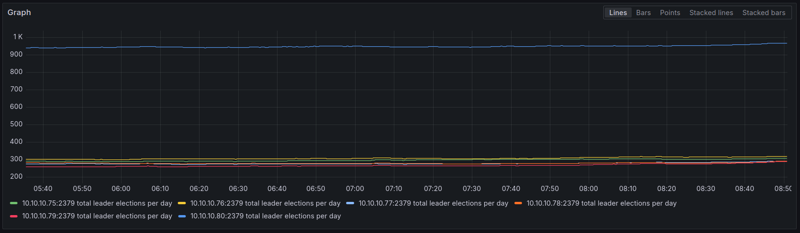
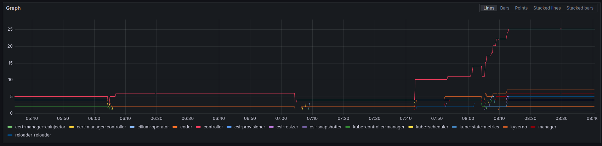
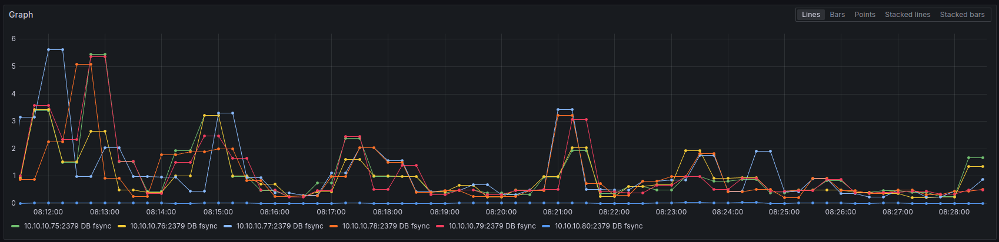

# Troubleshooting log

This is a log of various problems I have run into, their symptoms, how I diagnosed them, and how I fixed them.

## 2025-02-09

I've been unable to run the falco helm chart, with numerous pods entering a crashloopbackoff upon launch.
This made the system as a whole unusable on my cluster.

### Symptoms

- Some, not all Falco pods entered a crashloopbackoff upon launch, others were succeeding.
    - Seems to be related to specific nodes as 6 consistently work while the others do not.
    - Pod logs don't have an information about errors on initial review.

### Diagnosis

Enabled more logging for the pod logs to attempt to see what the problem is.
Following values were added to the helm chart:
```yaml
tty: true

falco:
  libs_logger:
    enabled: true
```

That then produced the following error message:

```
<timestamp> [libs]: libpman: failed to load BPF object (errno: 22 | message: Invalid argument)
```

After diving into issues on the falco github, found this issue: <https://github.com/falcosecurity/falco/issues/3323>.
Realized that's similar, but different as it's related to memory limits, while this is dealing with an Invalid argument.

Checking Node logs through the console, I saw messages of like the following:

```
<timestamp> Lockdown: falco: use of bpf to read kernel RAM is restricted; see man kernel_lockdown.7
```

That lead me to researching kernel lockdown, which sounded like the problem as I had noticied the main difference between the good and bad nodes was secureboot.
In kernel lockdown man page, it explains that booting in secureboot switches the lockdown to confidentiality automatically.

Found a PR, <https://github.com/siderolabs/talos/pull/8535> which was attempting to force lockdown back to integrity on builds.
The recommendation in the PR was to instead use the kernel parameters when building the image in the factory.

### Fix

Add kernel parameters to talos image to set lockdown to integrity level.
```
-lockdown lockdown=integrity
```

Upgrade all nodes to new image, re-deploy falco.


## 2024-11-17 ETCD leader election lost pod restarts

I've been running into issues with etcd averaging at least 1000 leader elections per day.
This causes a lot of pod restarts, and instability in the cluster.

### Symptoms

- Prometheus Query for etcd leader elections per day: `changes(etcd_server_leader_changes_seen_total{job=~".*etcd.*", job="kube-etcd"}[1d])`
  - Main node (node with vip assigned to it): ~1000 leader elections per day
  - Other control plane nodes: ~300 leader elections per day
  - 
- Any pod that interacted with the kubernetes API server or had HA through etcd would be restarted at least once a day, usually once an hour.
  - Pod logs would indicate that the pod had lost the leader election, but it would be the only replica of the pod.
  - Most notable were the cilium-operator pod and kyverno *-controller pods, reaching up to 5 and 25 restarts per hour respectively.
  - Prometheus Query for pod restarts per hour: `(sum(increase(kube_pod_container_status_restarts_total[1h])) by (container)) > 0`
  - 

### Diagnosis

I knew something was wrong with etcd specifically because this had been happening for a while, across multiple pods, and multiple configurations of those pods.

[Talos etcd troubleshooting guide](https://www.talos.dev/v1.8/guides/troubleshooting/etcd/)
  - Ran `talosctl logs etcd` against the main control plane node and found the following warning quite often:
    ```
    <node-ip>: {"level":"warn","ts":"<ts>","caller":"etcdserver/util.go:170","msg":"apply request took too long","took":"107.606765ms","expected-duration":"100ms","prefix":"read-only range ","request":"key:\"<various-lease-names>\" ","response":"range_response_count:1 size:518"}
    ```
  - That pointed to etcd being slowed down by something consistently.

First guess was to increase timeouts for etcd, however I briefly looked to see if any nodes were performing fine.
Here's the Prometheus query for etcd commit latency: `histogram_quantile(0.99, sum(rate(etcd_disk_backend_commit_duration_seconds_bucket{job=~".*etcd.*"}[$__rate_interval])) by (instance, le))`.
I found that 4/5 of the control plane nodes were taking ~1s to complete, but one node was taking ~30ms.


I started comparing the configuration of the vms in Proxmox and found that the single control plane node that was performing well was using a local disk and not on ceph.
I had previously started to move my kubernetes nodes off of ceph since I didn't need them to be highly available themselves, the cluster itself was the high availability layer.


### Fix

- Move control plane storage off Ceph and onto local disk per node.

After watching the etcd commit latency graph I saw all the other nodes come down to under 50ms of commit latency, more than reasonable for ceph.
Pods also stopped restarting due to leader election loss, and the total leader elections count per day started to drop.


